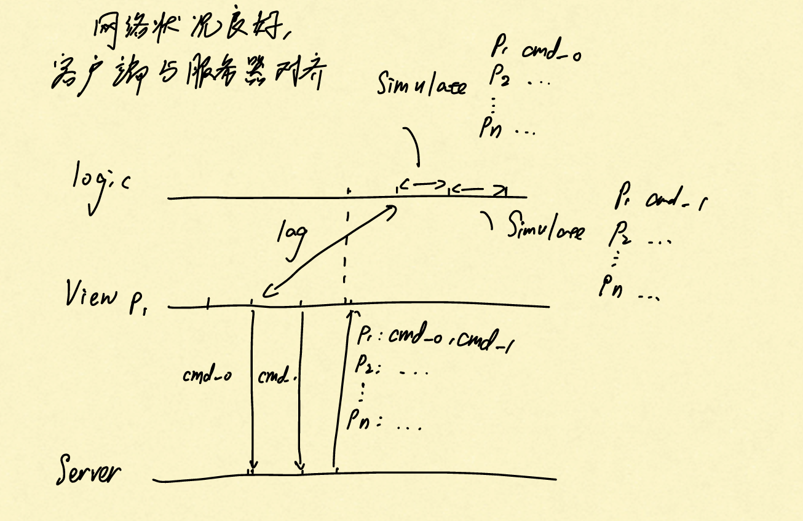
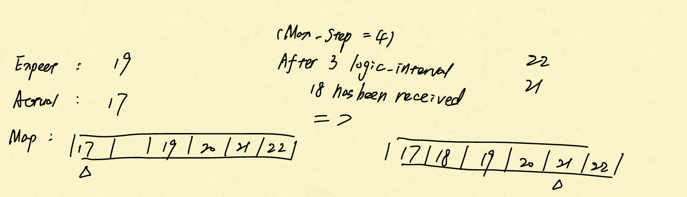
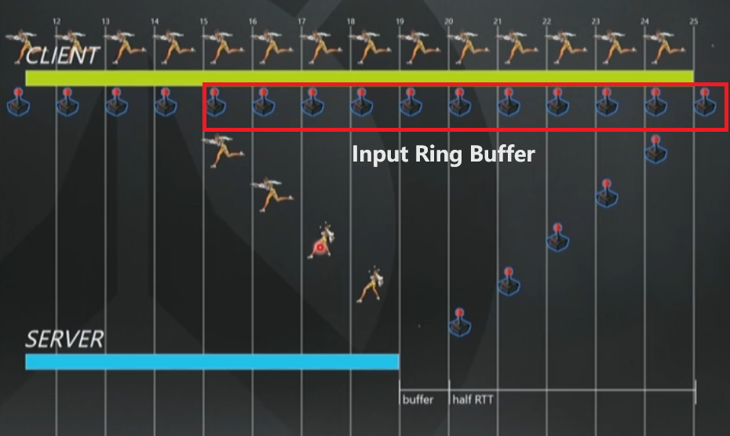
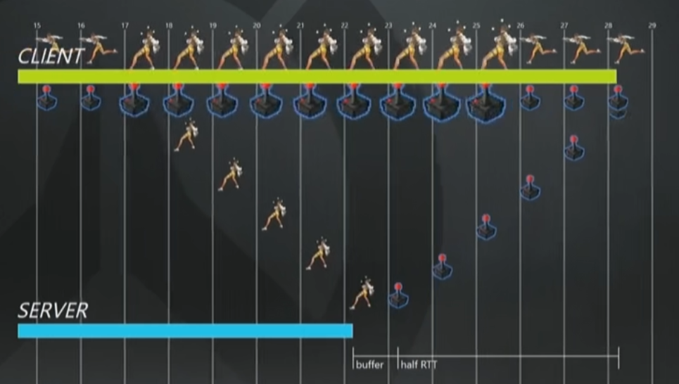
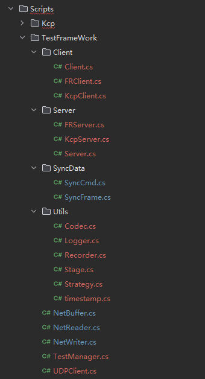
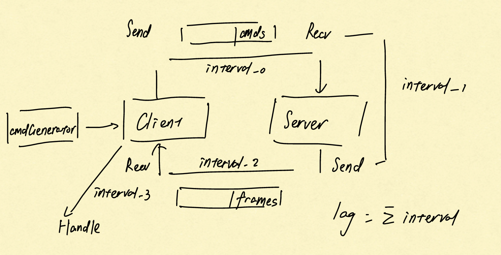

## Lockstep原理

### 服务器监听客户端，定期广播用户操作

 

**参数：服务器时钟频率**

### 表现与逻辑分离

 

**参数：逻辑帧率，渲染帧率**

**逻辑帧只有在收到服务器的广播后才会推进，通过在轮询中更新期望逻辑帧号，实现弱网络环境中的追帧功能**

### 数学需求

**一致的随机数，去浮点数和整数数学库**

## 优化方向

### 预表现

#### 表现层预表现

**在逻辑层未收到下一帧数据时，表现层通过当前速度平滑插值**

**收到下一帧数据后，表现层向逻辑层靠拢**

**参数：预表现减速率（防止预测过度）**

#### **逻辑层预表现**

**需求：客户端领先服务器**

 

**一旦从服务器回包发现预测失败，我们把你的全部输入都重播一遍直至追上当前时刻。如下图41中的第17帧所示，客户端认为猎空正在跑路，而服务器指出，你已经被晕住了，有可能是受到了麦克雷的闪光弹的攻击。**

 

**接下来的流程是，当客户端收到描述角色状态的数据包时，我们基本上就得把移动状态及时恢复到最近一次经过服务器验证过状态上去，而且必须重新计算之后所有的输入操作，直至追上当前时刻（第25帧）。**

**我们肯定知道我们到底被晕了多久。**

**到了下图第33帧以后，客户端就知道已经不再是晕住的状态了，而服务器上也正在模拟相同的情况。不再有奇怪的同步追赶问题了。一旦进入这个移动状态，就可以重发玩家当前时刻的操作输入了。**

#### 丢包问题

 **服务器试图保持了一个小的、保存未模拟输入的缓冲区，但是让它尽量的小，以保证游戏操作的流畅。一旦这个缓冲区是空的，服务器只能根据你最后一次输入去“猜测”。等到真正的输入到达时，它会试着“缓和”，确保不会弄丢你的任何操作，但是也会有预测错误。**

**服务器意识到丢了一些来自客户端的包以后，就会复制先前的输入操作来就行预测，并发包告诉客户端丢包。客户端会进行时间膨胀，比约定的帧率更快地进行模拟。结果就是，这些输入来的越来越快。服务器上缓冲区也会跟着变大，可以容忍更多地丢包，如果真的发生丢包也有可能在缓冲期间补上。**

**一旦服务器发现，你现在的网络恢复健康了，客户端会做相反的事情：它会缩小时间刻度，以更慢的速度发包。同时服务器会减小缓冲区的尺寸。**

**如果这个过程持续发生，那目标就会是不要超过承受极限，并通过输入冗余来使得预测错误最小化。**

### 网络优化（基于UDP的解决方案）

#### 自动重传请求（ARQ）

**三种：等待式，back-N，选择重传**

#### 前向冗余纠错（FEC）

**发下一个包的时候如果还没确认就把两个一起发，确认了F2，就隐含了确认F1，发送前面发过的冗余包来实现可靠UDP**

**FEC-Lite：通讯层简单的将前两帧进行重发；接收方不进行确认，控制层检测丢帧时主动请求服务器重传**

**ARQ-FEC：通讯层采用ARQ，控制层采用FEC但不进行确认**

## 业内相关方案

### 需求分析

**左摇杆的连续输入和右技能的离散输入（通常每秒的有效输入不会超过三个）**

**格斗游戏每个招式都有起手时间和恢复时间。比如以 DOA 里霞的 P (拳为例) 这个属于比较快的招式，它的帧数为 9(2)13 ，就是起手有 9 frame ，有 2 frame 的击中判定，然后有 13 frame 的恢复时间无法发出新招。**	

**那么在对战中，只要网络延迟小于最小的起手帧数，就可以通过对手反馈的frame来判断自身当前的状态。**

**需要考虑的问题：1. 网络延迟如果大于上述阈值，应该减少渲染帧率还是进行预测回滚；2. 如何保证客户端与服务器之间传输的可靠性；3. 是否需要为不同频率的输入设计不同的传输方案**

**基于本项目采用的UDP协议，首先需要解决报文乱序、丢失重传的问题。**

### 参考方案

**KCP|UDT|基于帧同步的冗余重传|Lwip|Enet**

| 方案     | 落地案例                  | 原理或特性                                                   |
| -------- | ------------------------- | ------------------------------------------------------------ |
| KCP      | 《原神》                  | 乱序重排、重传、滑动窗口、拥塞控制                           |
| FEC      | 《火影忍者》              | 基于帧滑动窗口的全冗余丢包对抗，上行空帧合并，下行一帧一包，冗余率在 100% 左右 |
| FEC      | 《2K online》《王者荣耀》 | 动态冗余2~8帧，使用 Input 异或去重与RLE                      |
| QUIC     | TQUIC                     | 零RTT连接建立；无队首阻塞的多路复用；可选的不可靠或半可靠的传输；用户态实现，使开发、测试和迭代周期更高效更简单 |
| 部分RUDP | 《CF mobile》             | 关键状态逻辑采用可靠包（放在我们这可以是技能释放），移动包采用非可靠保序包 |

## 评估指标

**不同网络环境下各个方案的最大延迟，97Per，流量以及一些其他的相关数据。**

## 测试框架

#### 模拟输入

**状态：0（idle），1（move），2（defend），3（light_attack），4（heavy_attack）**

**高频的移动输入，**`weight=[30(idle), 70(move)]`

**低频的技能输入，**`weight = [40(idle), 20(defend), 20(light_attack), 20(heavy_attack)]`**，假定渲染帧率为30fps设定后摇 **

`count_case[0(idle), 0(move), 15(defend), 10(light_attack), 20(heavy_attack]`

**当对手的处于攻击状态，且自身未在后摇时，采用防御权重：**`weight = [25, 40, 15, 20]`

**count_case会根据渲染帧率的变化乘上对应的系数：**`count_case *=  int(args.vfps / 30)`

#### 文件结构

 

#### 数据流向

 

## 测试结果（表现帧率和逻辑帧率都是60fps，服务器转发频率30fps）

#### KCP

##### Lag = 0

| Drop | 平均非传输开销（ms） | 平均传输开销（ms） | Average（ms） | 95%（ms） | max（ms） |
| ---- | -------------------- | ------------------ | ------------- | --------- | --------- |
| 0    | 41.92                | 54.63              | 96.55         | 166       | 234       |
| 10   | 41.86                | 77.62              | 119.48        | 216       | 382       |
| 20   | 41.75                | 117.74             | 159.49        | 301       | 803       |
| 30   | 42.11                | 200.92             | 243.03        | 500       | 1700      |
| 40   | 41.75                | 488.44             | 530.19        | 1867      | 4790      |
| 50   | 42.54                | 17167.83           | 17210.37      | 39813     | 41512     |

**非传输开销 interval_1 与 interval_3 之和基本固定，由表现帧率和服务器转发频率共同决定**

**由于KCP的实现中每次重传都会将 RTO（超时重传定时器） * 1.5，因此在高丢包率的网络环境下，频繁的丢包将使得等待时间指数级增长，从而严重影响传输的效率**

##### Drop = 0

| Lag  | 平均非传输开销（ms） | 平均传输开销（ms） | Average（ms） | 95%（ms） | max（ms） |
| ---- | -------------------- | ------------------ | ------------- | --------- | --------- |
| 0    | 41.92                | 54.63              | 96.55         | 166       | 234       |
| 50   | 41.76                | 172.61             | 214.37        | 286       | 467       |
| 100  | 41.7                 | 287.69             | 329.44        | 451       | 950       |

**网络延迟在一个RTT中的贡献系数为2，同样因为重传机制，RTO需要大于Lag才能收到有效的包，因此会产生额外的重传耗时**

#### FR（Full Redundant）

##### Lag = 0

| Drop | 冗余比 | 平均非传输开销（ms） | 平均传输开销（ms） | Average（ms） | 95%（ms） | max（ms） |
| ---- | ------ | -------------------- | ------------------ | ------------- | --------- | --------- |
| 0    | 1.85   | 41.69                | 0.94               | 42.63         | 52        | 71        |
| 10   | 2.81   | 43.67                | 17.80              | 61.47         | 100       | 201       |
| 20   | 3.35   | 48.32                | 30.93              | 79.25         | 134       | 278       |
| 30   | 3.75   | 44.96                | 42.55              | 87.51         | 164       | 316       |
| 40   | 4.00   | 44.36                | 49.95              | 94.31         | 183       | 365       |
| 50   | 4.87   | 46.30                | 71.63              | 117.93        | 234       | 516       |

**冗余比和平均传输开销随着丢包率线性（？）增长**

##### Lag = 50

| Drop | 冗余比 | 平均非传输开销（ms） | 平均传输开销（ms） | Average（ms） | 95%（ms） | max（ms） |
| ---- | ------ | -------------------- | ------------------ | ------------- | --------- | --------- |
| 0    | 7.30   | 41.25                | 128.67             | 169.92        | 185       | 218       |
| 10   | 7.62   | 43.35                | 136.05             | 179.40        | 218       | 316       |
| 20   | 7.91   | 41.75                | 143.86             | 185.61        | 241       | 466       |
| 30   | 8.33   | 42.24                | 155.12             | 197.36        | 267       | 466       |
| 40   | 8.94   | 41.96                | 169.22             | 211.18        | 301       | 499       |
| 50   | 9.56   | 44.63                | 185.88             | 230.51        | 350       | 713       |

##### Drop = 0

| Lag  | 冗余比 | 平均非传输开销（ms） | 平均传输开销（ms） | Average（ms） | 95%（ms） | max（ms） |
| ---- | ------ | -------------------- | ------------------ | ------------- | --------- | --------- |
| 0    | 1.85   | 41.69                | 0.94               | 0.94          | 42.63     | 52        |
| 50   | 7.30   | 41.25                | 128.67             | 128.67        | 169.92    | 185       |
| 100  | 11.7   | 42.95                | 230.07             | 273.02        | 285       | 512       |

**由于网络延迟导致的冗余与Lag成正比，应想办法去避免。**

## 结论

**rudp方案都是基于udp协议，在其上层额外采取不同的策略来做到保序与不丢包。因此，上层逻辑的复杂性会影响方案的传输开销，例如KCP这种需要进行乱序重排、重传、滑动窗口、拥塞控制的方案在弱网环境下的开销会指数增加，而全冗余方案则呈线性增长。**

**对于追求实时性的格斗游戏而言，通过冗余来做到可靠相比与其他复杂的方案，不论从直觉还是数据来讲都是更好的选择。但是传输数据报的冗余会减少服务器的有效带宽，如何避免非必要的冗余将是后续工作的研究方向。**

## 框架的复用

**我采用了继承基类，重写虚函数的方式实现多态。我在Client和Server基类中定义了需要重写的Send()、Receive()等虚函数，实现了ViewTick()、LogicTick()、BroadCastTick()等可以在不同方案中服用的功能函数。在未来想要测试新的方案时，只需要实现相关的Client、Server派生类，重写虚函数，并在TestManager类中的switch中初始化即可。**

